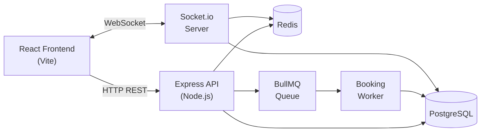
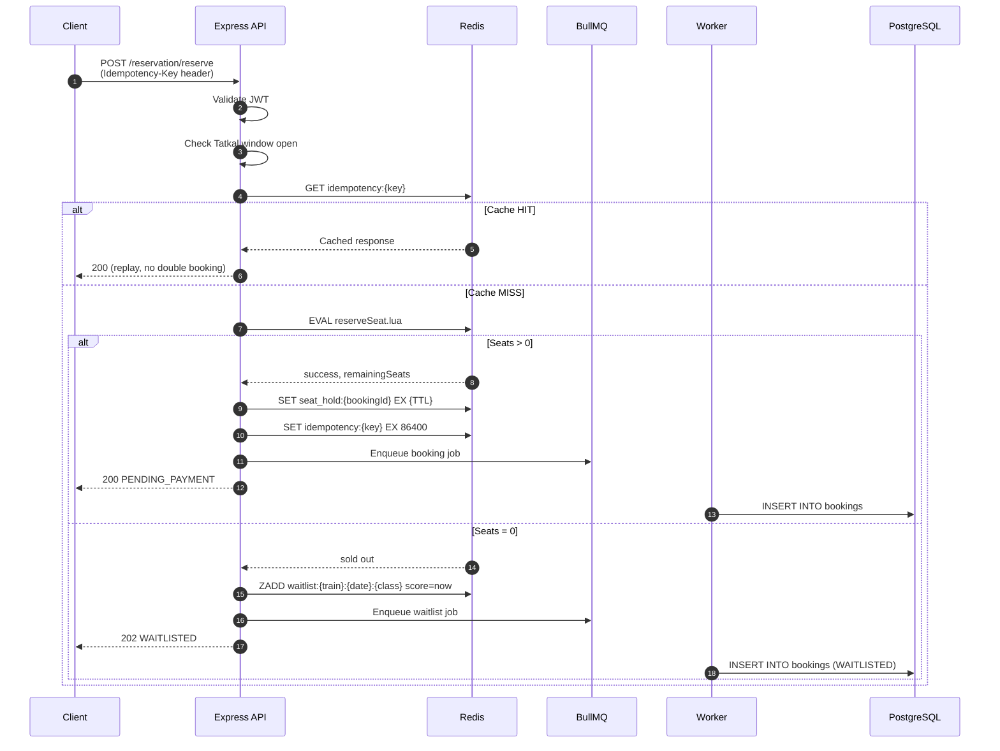
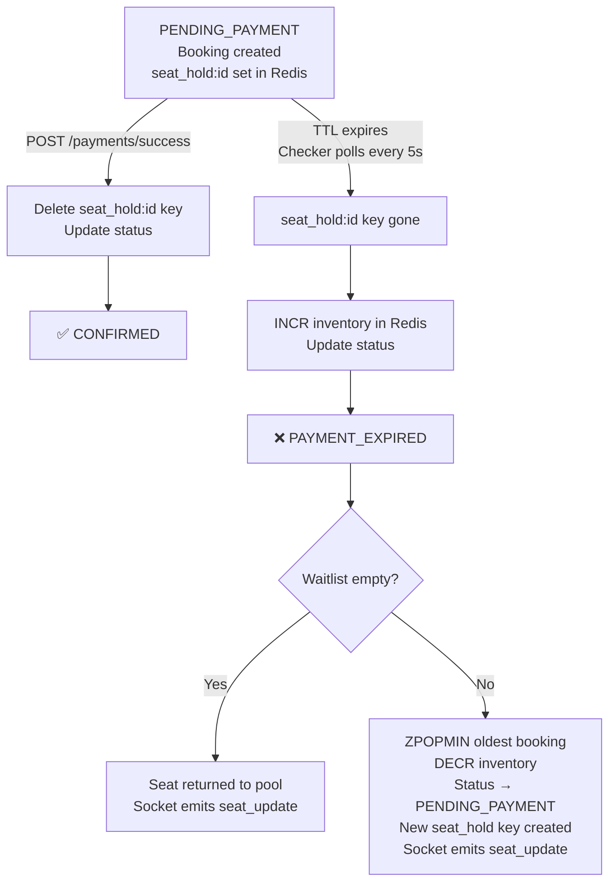
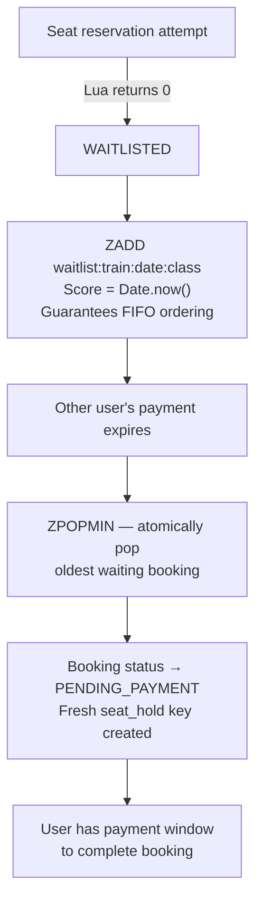
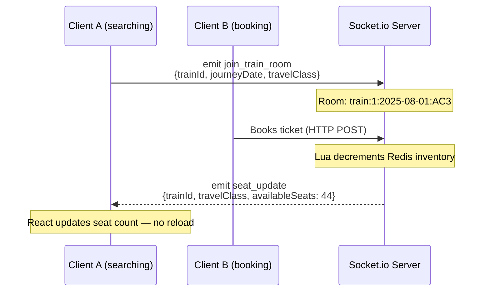
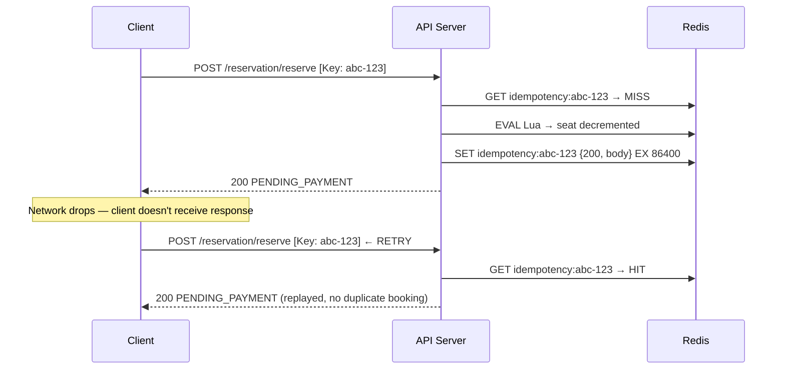

# IRCTC Tatkal Booking System

> A scalable railway ticketing backend demonstrating atomic seat allocation, idempotent reservations, FIFO waitlist management, asynchronous persistence, and real-time updates — built to survive the Tatkal booking stampede.

---

## Table of Contents

1. [Project Overview](#1-project-overview)
2. [Features](#2-features)
3. [Tech Stack](#3-tech-stack)
4. [Architecture](#4-architecture)
5. [Booking Flow](#5-booking-flow)
6. [Payment Flow](#6-payment-flow)
7. [Waitlist Flow](#7-waitlist-flow)
8. [Socket.io Real-Time Flow](#8-socketio-real-time-flow)
9. [Key Design Decisions](#9-key-design-decisions)
10. [Race Condition: Without vs With Lua](#10-race-condition-without-vs-with-lua)
11. [Idempotency: Safe Retries](#11-idempotency-safe-retries)
12. [API Reference](#12-api-reference)
13. [Folder Structure](#13-folder-structure)
14. [Local Development Setup](#14-local-development-setup)
15. [Environment Variables](#15-environment-variables)
16. [Future Improvements](#16-future-improvements)

---

## 1. Project Overview

The IRCTC Tatkal booking window opens at a precise scheduled time and immediately receives a massive burst of concurrent traffic — thousands of users attempting to book a finite number of seats in the same few seconds.

### The Core Problem

A naive approach (read seats → check → decrement in SQL) breaks under concurrency:

- Two requests read `availableSeats = 1` simultaneously.
- Both pass the check.
- Both decrement → `availableSeats = -1`.
- **Overselling occurs.**

Additionally, network drops and frontend retries cause **duplicate bookings** unless the server is explicitly designed to handle repeated requests.

### How This Project Solves It

| Challenge | Solution |
|---|---|
| Race conditions / overselling | Redis Lua script (atomic check + decrement) |
| Duplicate bookings on retry | Idempotency key cached in Redis (24h TTL) |
| Slow database writes blocking the API | BullMQ background worker persists asynchronously |
| Unreleased seats from abandoned payments | Redis TTL + 5-second polling checker |
| Fair seat allocation to waitlisted users | Redis Sorted Set (`ZADD`/`ZPOPMIN`) — strict FIFO |
| Stale seat counts on client UIs | Socket.io pushes `seat_update` on every change |

---

## 2. Features

### Backend

- **JWT Authentication** — Stateless user auth via signed tokens.
- **Train Search** — Case-insensitive station name search across the `trains` table.
- **Seat Availability** — Redis-backed live seat count per train, date, and class.
- **Tatkal Window Enforcement** — Time-based open/close gate configurable via `TATKAL_OPEN_TIME`. Admin override available for demos.
- **Atomic Seat Reservation** — Redis Lua script fuses the check and decrement into a single uninterruptible operation.
- **Idempotency** — Reservation API requires an `Idempotency-Key` header. Duplicate requests return the cached response without re-executing.
- **BullMQ Background Processing** — Successful Redis reservations are enqueued; a worker persists rows to PostgreSQL asynchronously.
- **Payment Hold (Redis TTL)** — A `seat_hold:{bookingId}` key expires automatically after the configured TTL window.
- **Payment Expiry Checker** — A 5-second polling loop scans `PENDING_PAYMENT` bookings and transitions expired ones to `PAYMENT_EXPIRED`.
- **Waitlist** — When seats hit 0, users are placed in a Redis Sorted Set with their timestamp as score.
- **Auto-Promotion** — On payment expiry, the oldest waitlisted booking is atomically promoted to `PENDING_PAYMENT` with a fresh hold.
- **My Bookings API** — Authenticated endpoint returning a user's full booking history.
- **Socket.io Real-Time Updates** — Clients join train-specific rooms and receive live `seat_update` events on every inventory change.
- **Admin Demo Controls** — Force the Tatkal window open or closed without touching system time.

### Frontend

- Signup / Login with JWT storage.
- Train search by station name and date.
- Seat availability display per travel class.
- One-click booking with auto-generated idempotency key (`crypto.randomUUID()`).
- My Bookings panel with live booking status.
- 60-second payment countdown timer with auto-refresh.
- "Complete Payment" button calling `POST /payments/success`.
- Socket.io integration — seat counts update in real time without page refresh.
- Live Updates log panel (last 3 socket events).

---

## 3. Tech Stack

| Layer | Technology |
|---|---|
| **Frontend** | React 19, Vite, Axios, React Router DOM |
| **Backend** | Node.js, Express.js |
| **Database** | PostgreSQL |
| **Cache / Atomic Ops** | Redis (ioredis) |
| **Background Queue** | BullMQ |
| **Real-Time** | Socket.io |
| **Authentication** | JWT (jsonwebtoken), bcrypt |
| **Containerization** | Docker, Docker Compose |

---

## 4. Architecture



> The Socket.io server is co-located with the Express API. Workers and the payment checker run as background tasks within the same Node.js process.

---

## 5. Booking Flow



**Key detail:** The Lua script (`reserveSeat.lua`) performs the seat check and decrement as a single atomic operation inside Redis. No SQL query is executed in the hot path — PostgreSQL writes happen later, inside the BullMQ worker.

---

## 6. Payment Flow



> The payment checker runs as a `setInterval` inside the API server process, polling PostgreSQL for `PENDING_PAYMENT` rows every 5 seconds and cross-checking whether their Redis hold key still exists.

---

## 7. Waitlist Flow



- **FIFO guarantee:** Redis Sorted Sets order members by score. Using `Date.now()` as the score means the member inserted first always has the lowest score and is always promoted first via `ZPOPMIN`.
- **Atomicity:** `ZPOPMIN` pops and returns the element in a single command — no two workers can pop the same entry.

---

## 8. Socket.io Real-Time Flow



`seat_update` is emitted on **every** inventory change:
- Successful seat reservation (decrement).
- Payment expiry — seat returned (increment).
- Waitlist promotion — seat immediately re-decremented (decrement).

---

## 9. Key Design Decisions

### Redis Lua Script — Atomic Seat Allocation

```
if seats > 0 then
  DECR seats
  return {1, remaining}
else
  return {0}
end
```

Redis executes Lua scripts atomically — no other command can interleave. This eliminates the check-then-act race condition without distributed locks, complex transactions, or `SELECT FOR UPDATE` contention in PostgreSQL.

### BullMQ — Decouple API Response from DB Write

The reservation API returns `200 PENDING_PAYMENT` before PostgreSQL is touched. The BullMQ worker handles the insert asynchronously. This means:
- **API latency stays in milliseconds** even at high concurrency.
- **Retries are built-in** — if the worker crashes mid-write, BullMQ retries the job automatically.

### Redis TTL + Polling — Payment Expiry

Rather than relying on Redis Keyspace Notifications (which require additional configuration and can miss events if the subscriber is down), the payment checker uses a simple `setInterval` every 5 seconds. Missed expirations are automatically caught the next time the server starts — zero configuration drift.

### Redis Sorted Set — FIFO Waitlist

`ZADD waitlist:key score=timestamp bookingId` naturally creates an ordered queue. `ZPOPMIN` atomically extracts the oldest entry. No separate queue table or cursor-based SQL queries needed.

### Idempotency — Safe Client Retries

Every `POST /reservation/reserve` call requires an `Idempotency-Key` UUID header. The middleware:
1. Checks Redis for that key.
2. **Cache HIT:** Returns the stored `{statusCode, body}` immediately — no Lua executed.
3. **Cache MISS:** Intercepts the outgoing `res.json()` call, stores the result in Redis with a 24-hour TTL, then sends normally.

This design requires zero changes to the controller or service layer.

### Socket.io — Push Over Poll

Rather than clients polling `GET /trains/search` every few seconds to see updated seat counts, the server pushes `seat_update` events directly to clients in the relevant room. Clients receive updates within milliseconds of the inventory change.

### JWT — Stateless Authentication

No session store required. The API verifies the token signature on every request using the shared `JWT_SECRET`. User identity (`req.user.id`) flows directly into booking and history queries.

### Polling vs Keyspace Notifications

| | Polling (current) | Keyspace Notifications |
|---|---|---|
| Configuration | None | Requires `notify-keyspace-events KEA` in Redis config |
| Missed events on restart | ✅ Caught automatically | ❌ Missed events are lost |
| Complexity | Low | Medium (Pub/Sub listener) |
| Latency | ≤ 5 seconds | Near-instant |

For a demo system, polling at 5-second intervals is simpler, more reliable, and acceptable for the use case.

---

## 10. Race Condition: Without vs With Lua

### ❌ Without Lua — Standard Read-Check-Write

```
T=0ms  Request A: SELECT available_seats → 1
T=0ms  Request B: SELECT available_seats → 1
T=1ms  Request A: UPDATE SET available_seats = 0  ✅
T=1ms  Request B: UPDATE SET available_seats = -1 ❌ OVERSOLD
```

Both requests passed the check because they both read `1` before either update was committed.

### ✅ With Redis Lua — Atomic Check + Decrement

```
T=0ms  Request A: EVAL reserveSeat.lua  → Redis locks script
T=0ms  Request B: EVAL reserveSeat.lua  → queued, waits
T=1ms  Request A: sees 1 → decrements → returns SUCCESS (remaining: 0)
T=1ms  Request B: sees 0 → returns SOLD OUT → routed to waitlist
```

The Lua script is the only path that modifies inventory. There is no window between check and write. Overselling is structurally impossible.

---

## 11. Idempotency: Safe Retries

### Scenario: Network Drop on Submit



The header `X-Idempotency-Replayed: true` is set on replayed responses so clients can distinguish them if needed.

---

## 12. API Reference

| Method | Endpoint | Auth | Purpose |
|---|---|---|---|
| `POST` | `/auth/signup` | ❌ | Register a new user |
| `POST` | `/auth/login` | ❌ | Authenticate, receive JWT |
| `GET` | `/trains/search` | ✅ | Search trains by source, destination, date |
| `GET` | `/trains/:id/availability` | ✅ | Seat availability for a specific train |
| `POST` | `/reservation/reserve` | ✅ | Reserve a seat (requires `Idempotency-Key` header) |
| `GET` | `/bookings/my` | ✅ | Get all bookings for authenticated user |
| `POST` | `/payments/success` | ✅ | Mark a pending booking as paid |
| `GET` | `/tatkal/status` | ❌ | Check if Tatkal window is currently open |
| `POST` | `/admin/tatkal/open` | ❌ | Force Tatkal window OPEN (demo override) |
| `POST` | `/admin/tatkal/close` | ❌ | Force Tatkal window CLOSED (demo override) |
| `POST` | `/admin/tatkal/reset` | ❌ | Clear override, restore time-based logic |

**Standard Response Envelope:**
```json
{
  "success": true,
  "message": "...",
  "data": { ... }
}
```

---

## 13. Folder Structure

```
irctc-tatkal-system/
├── docker-compose.yml          # Spins up PostgreSQL + Redis
├── .env.example                # Environment variable template
│
├── app/                        # Node.js backend
│   ├── server.js               # Express + Socket.io entry point
│   └── src/
│       ├── config/
│       │   ├── db.js           # PostgreSQL pool
│       │   ├── redis.js        # ioredis client
│       │   ├── socket.js       # Socket.io initialisation
│       │   └── env.js          # Validated env vars
│       ├── controllers/        # Route handlers (thin layer)
│       ├── middleware/
│       │   ├── auth.js         # JWT verification
│       │   └── idempotency.js  # Idempotency key middleware
│       ├── routes/             # Express router definitions
│       ├── scripts/
│       │   └── reserveSeat.lua # Atomic Lua seat reservation
│       ├── services/
│       │   ├── reservation.service.js  # Lua execution
│       │   ├── inventory.service.js    # Redis key builder
│       │   ├── payment.checker.js      # TTL expiry polling loop
│       │   ├── tatkal.service.js       # Window open/close logic
│       │   ├── train.service.js        # Search queries
│       │   ├── booking.service.js      # My bookings query
│       │   └── auth.service.js         # User creation / login
│       ├── queue/
│       │   └── booking.queue.js        # BullMQ queue definition
│       ├── workers/
│       │   └── booking.worker.js       # BullMQ consumer
│       └── migrations/                 # SQL schema files
│
└── frontend/                   # React + Vite
    └── src/
        ├── components/
        │   ├── Navbar.jsx
        │   ├── TrainSearch.jsx  # Search + Socket.io integration
        │   └── MyBookings.jsx   # Booking list + payment timer
        ├── pages/
        │   ├── Login.jsx
        │   ├── Signup.jsx
        │   └── Dashboard.jsx
        └── services/
            └── api.js           # Axios instance + JWT interceptor
```

---

## 14. Local Development Setup

### Prerequisites
- [Docker Desktop](https://www.docker.com/products/docker-desktop/) running
- Node.js 18+

### Step 1 — Clone & configure environment

```bash
git clone <repository-url>
cd irctc-tatkal-system
cp .env.example .env
# Edit .env with your preferred values
```

### Step 2 — Start infrastructure

```bash
docker-compose up -d
```

This starts PostgreSQL (port 5432) and Redis (port 6379).

### Step 3 — Start the backend

```bash
cd app
npm install
npm run dev
```

The server runs migrations and seeds sample train data on first boot. Backend available at `http://localhost:3000`.

### Step 4 — Start the frontend

```bash
cd ../frontend
npm install
npm run dev
```

Frontend available at `http://localhost:5173`.

---

## 15. Environment Variables

| Variable | Description | Default |
|---|---|---|
| `DATABASE_URL` | PostgreSQL connection string | — |
| `REDIS_URL` | Redis connection string | `redis://localhost:6379` |
| `JWT_SECRET` | Secret for signing JWT tokens | — |
| `PORT` | Express server port | `3000` |
| `TATKAL_OPEN_TIME` | Time Tatkal window opens (HH:MM) | `10:00` |
| `PAYMENT_HOLD_TTL_SECONDS` | Seconds before payment expires | `60` |

---

## 16. Future Improvements

These are **not implemented** — listed as potential next steps.

- **Distributed Tracing** — OpenTelemetry to trace a request from HTTP → Lua → BullMQ → PostgreSQL.
- **Metrics & Dashboards** — Prometheus + Grafana for queue depth, Lua execution time, payment expiry rates.
- **Horizontal Scaling** — Socket.io Redis Adapter to broadcast `seat_update` events across multiple Node.js instances.
- **Real Payment Gateway** — Replace the mock `POST /payments/success` with Razorpay or Stripe webhook flows.
- **Admin Dashboard** — UI for monitoring live seat inventory, queue depth, and booking status breakdown.
- **Rate Limiting** — Per-user reservation rate limits to prevent booking bot abuse.
